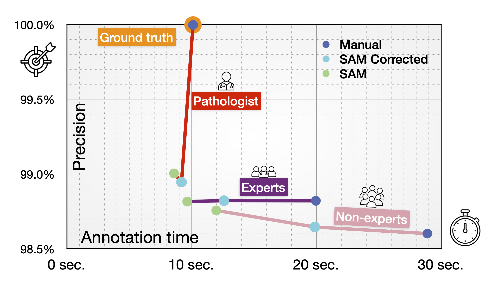

## Segment-Anything Model (SAM) Accelerates Annotations of Histopathological Images – A Case Study on Human Bone Marrow Megakaryocytes
 
 Rita Sarkis1,2,
 Lilly-Flore Celma3,1,
 Mathis Krause3,1,
 Claire Royer Chardon2,
 Natacha Dewarrat4,
 Maud Barthélemy3,
 Alejandro Alonso1,
 Enrico Boeri1,
 Tatiana Smirnova1,4,
 Jessica Sage3,
 Laurence de Leval2,
 Olaia Naveiras1,4,
 Daniel Sage3,5

<small><small>
1 Laboratory of Regenerative Hematopoiesis, Department of Biomedical Sciences, University de Lausanne, Switzerland —
2 Institute of Pathology, Department of Laboratory Medicine and Pathology, Lausanne University Hospital (CHUV) and University of Lausanne, Switzerland — 
3 Center for Imaging, Ecole Polytechnique Fédérale de Lausanne (EPFL), Switzerland — 
4 Hematology Service, Departments of Oncology and Laboratory Medicine, Lausanne University Hospital (CHUV) and University of Lausanne, Switzerland — 
5 Biomedical Imaging Group, School of Engineering, Ecole Polytechnique Fédérale de Lausanne (EPFL), Switzerland
</small></small>

### Abstract
AI is rapidly transforming diagnostic pathology, we present a new method for digital annotation using megakaryocytes (MKs) as a study case. MKs, responsible for platelet production, are diagnostically relevant but challenging to segment in H&E-stained bone marrow tissue sections due to their comparatively large size and complex morphology. We compared manual annotation with AI-driven segmentation using the Segment Anything Model (SAM) and SAM-corrected annotations. Our study demonstrated that SAM significantly accelerates annotation while maintaining accuracy. Using 2048×2048 tiles from 37 digitized, H&E-stained sections of diverse cellularity, we recorded annotation time and performance. SAM significantly accelerates annotations (20% faster for ground truth generation and 2 times faster for expert annotators), reducing workload while achieving comparable segmentation quality. This acceleration supports pathologists in quantitative morphology assessments, and provides a integrated solution for clinical adoption. Our open-source workflow establishes a standardized framework for AI-assisted annotation, paving the way for broader applications in histology.

### Keywords
Digital pathology, Pathology annotation, SAM, deep-learning, machine-learning, Bone marrow megakaryocytes, Bone marrow histopathology, Image analysis
